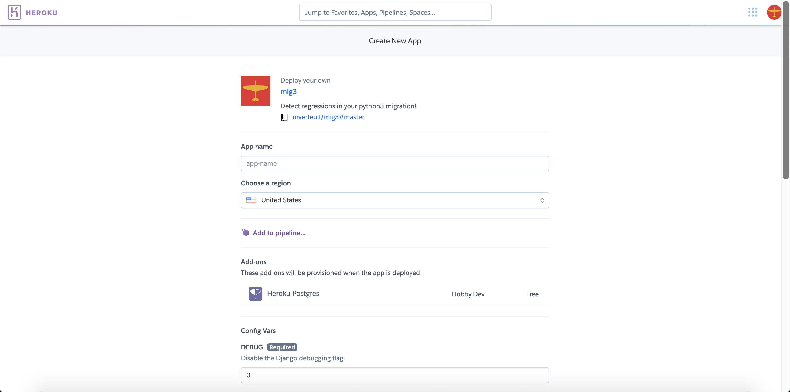
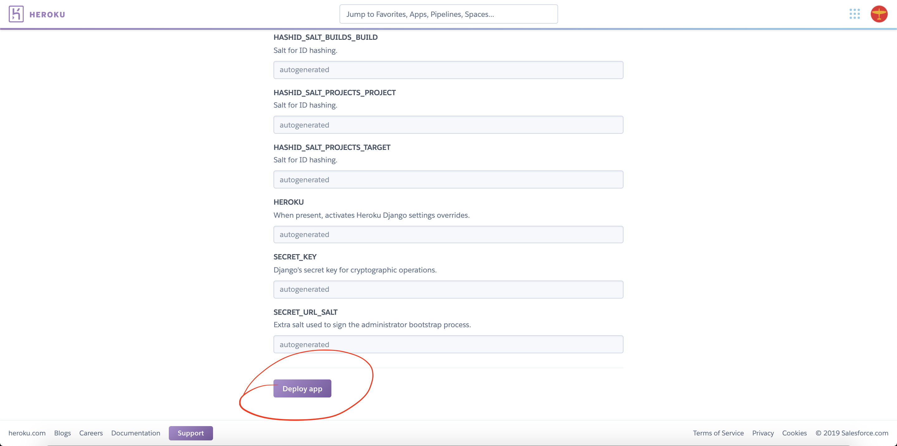
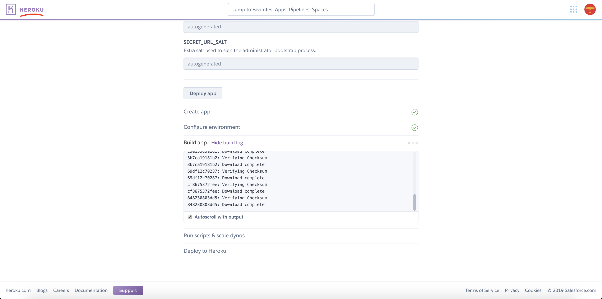
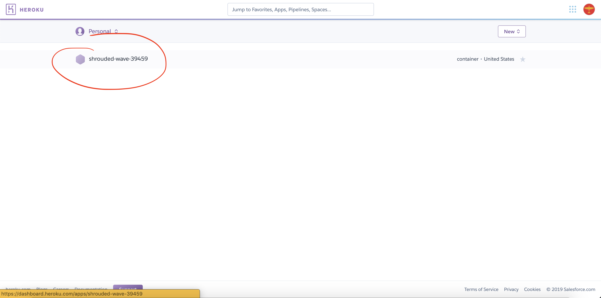
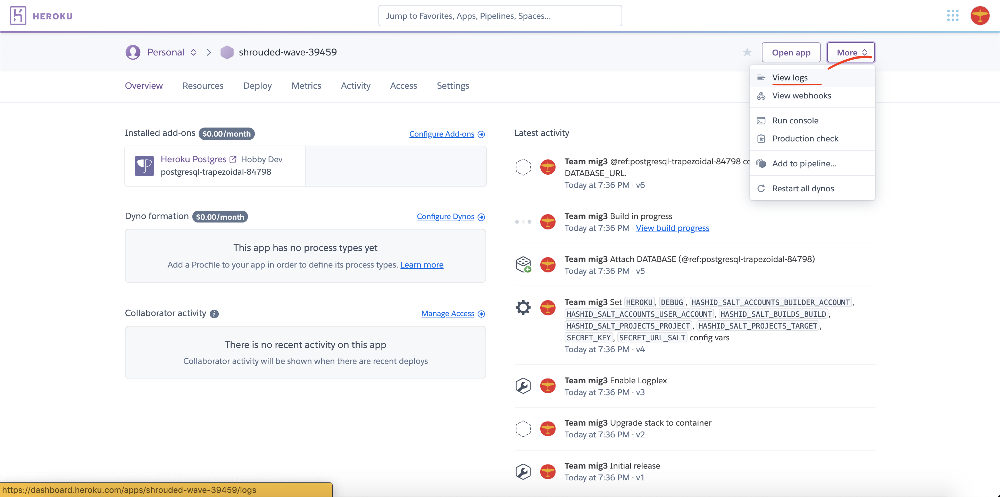
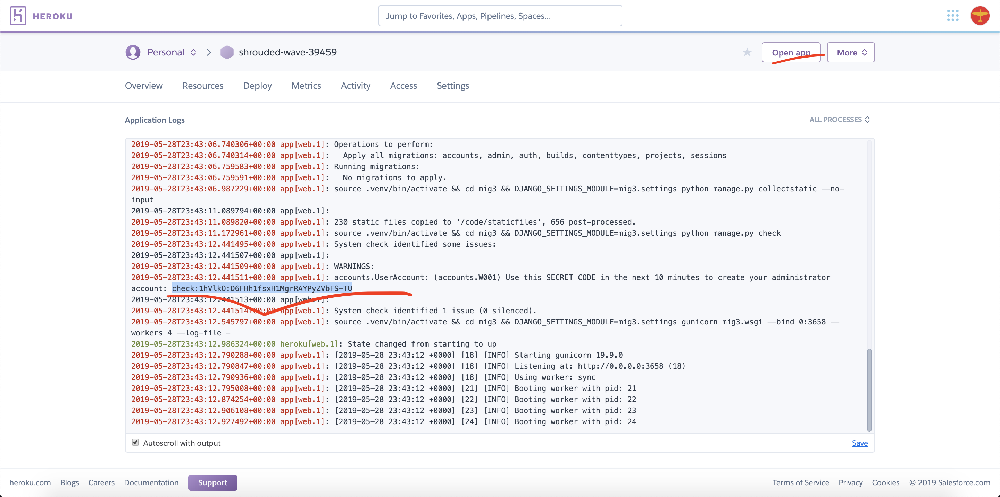
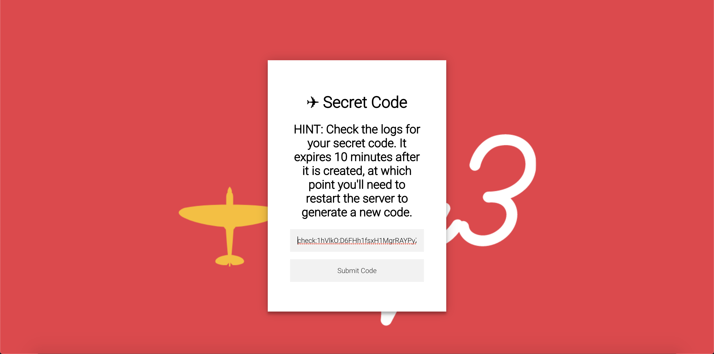
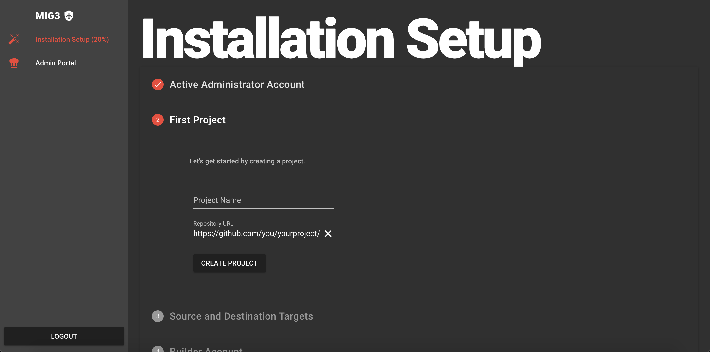

# Recommended Installation Instructions

## Deploying to Heroku

### Before getting started

-   If you don't have a Heroku account, you should create one now.

### Deploying your mig3 service

1.  Select the "Deploy to Heroku" button below to get started. 
    
1.  Scroll to the bottom of the page, past the environment variables. 
    
1.  Select the "Deploy App" button to kick off your deployment. 
    
1.  Now that the deploy has begun, open a new tab to your Heroku projects page. 
    
1.  Select on your new app on the projects page. 
    
1.  Select "More", and then "View logs". 
    
1.  Wait for deployment to complete, it may take about 10 minutes. Follow the deployment progress in the initial tab if you wish. When the deploy is complete, select the secret code in the log output and copy it to the clipboard. You must enter it within 10 minutes of it being generated or it will expire. Select "Open app" to proceed. 
    
1.  Enter the secret code that you copied in the previous step. Select "Submit Code". 
    
1.  Create your administrator account. You will be required to use a secure password. Security is not an optional feature of mig3. 
    
1.  Installation is nearly complete, follow the setup wizard instructions and you're ready to go! 
    
